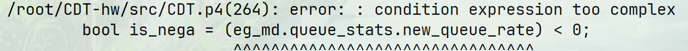

# 25-07-03

## 今日工作

今天主要阅读了他人的工作，一个是Princeton的ConQuest([Fine-Grained Queue Measurement in the Data Plane](https://doi.org/10.1145/3359989.3365408))，另一个是switch-ML([Scaling Distributed Machine Learning with In-Network Aggregation A. Sapio, M. Canini, C.-Y. Ho, J. Nelson, P. Kalnis, C. Kim, A. Krishnamurthy, M. Moshref, D. R. K. Ports, P. Richtarik. In Proceedings of NSDI’21, Apr 2021.](https://www.usenix.org/conference/nsdi21/presentation/sapio))。两项工作都公开了自己的源代码，其中switch-ML包含了控制平面以及客户端的代码，比较全面，可以作为入门p4的必读代码。

同时还顺手解决了一个bug。

这个bug的出现比较“诡异”，其上一行代码与它的逻辑相差无几，但是这里却报出了这样的错误。解决方法是使用临时变量储存metadata，并且将临时变量与该语句分散到不相邻的行中防止编译器优化；但是具体的原因尚未可知，目前猜测是PHV分配的原因。

## 日后工作思路

根据ConQuest代码结构的启发，可以考虑将数据平面代码调整为类似代码模板的结构，在明天可以抽出一些时间来尝试编写和编译。另外，需要根据switch-ML的控制平面代码重构一下控制平面代码以方便扩展，并设计相应客户端。

## 随记

前几天买的门帘今天终于到了，挂上去之后有了点创新港真正的单人间的味道。今天没有怎么逛，下午六点半左右就回宿舍装门帘，然后刷抖音刷个不停，以至于调整数据平面代码的计划又“被迫”延后到明天，还是在工位更有做科研的感觉（？）