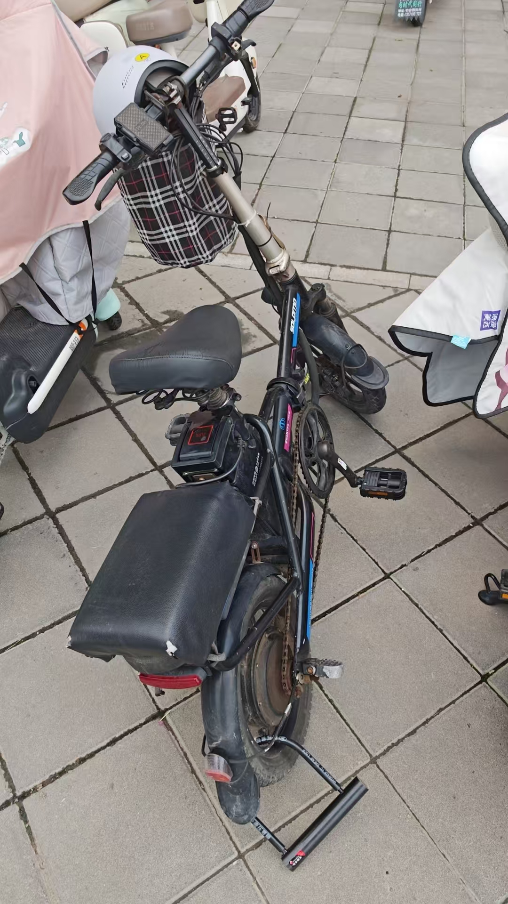

# 25-07-04

## 今日工作

今天主要尝试复现Network Load Balancing with In-network Reordering Support for RDMA论文中4.2章节的实验。阅读并了解了论文的大致框架以及主要idea，及设计一种部署在数据平面的负载均衡算法以适应RDMA的流量特征及对数据包按序发送的假设。但是在尝试在tofino交换机中运行该代码存在问题，问题如下所述：

- 论文中对于`reorder packets`的实现依赖于tofino2交换机的对于单个queue的`pause and resume`，但是tofino1交换机中并没有这个功能。可以考虑使用PFC对于不同优先级的流的暂停能力进行替代，但是暂未想出具体的实现思路。

- 论文作者所给出的代码经过编译后需要20个stages，但是tofino1最多支持12个stages。可以考虑简化代码逻辑以适应tofino1交换机的硬件限制，但是简化是否会带来一定的性能损失还有待商榷。

同时，尝试解决了CDT-hw数据平面代码中编译`cong_q_len_sum`时会出现的`internal compiler error`的奇妙错误，但是即使通过编译，在`context.json`中并没有找到相应的函数，预测该函数无法发挥作用。

## 日后工作思路

对于上述论文的复现，可以考虑简化代码逻辑以及重新设计`reorder packets`的思路，但是如果ms能够提供tofino2交换机的支持则完全没有必要进行上述尝试，因此此问题需要询问老师的意见再进行下一步的尝试。

## 随记

今天花了300块钱买了一辆“电骡子”，之所以叫“电骡子”是因为已经旧的不能再旧了，如下图：

虽然烂，而且老板说这玩意最多只能骑两年，两年质保期一过直接就进废品站了；但是就像朋友所说：“总算成为有车一族”，也算是有所慰藉。

不过自己花了五百块钱买了个移动硬盘用来做数据和代码备份，我可能宁愿骑着移动硬盘去上班————

