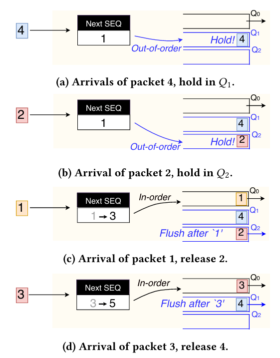

# 论文主要内容

由于RDMA的流量特征（RDMA 使用硬件级的按连接速率控制（即速率整形），导致数据包以较为连续的速率流动，几乎不存在较大的时间间隙）以及对数据包按序发送的假设（一旦收到失序包，认定为丢包），现有的负载均衡算法（FlowLet）对于RDMA的作用不好，因此提出了ConWeave，并在Tofino2交换机中部署。

ConWeave 由两个组件组成，一个运行在源端的 ToR（Top-of-Rack，机架顶部）交换机上，另一个运行在目的端的 ToR 交换机上。源端 ToR 组件会持续监测活跃流的路径延迟，并在检测到拥塞时尝试重新路由，而不是被动地等待流间隙（flowlet gaps）。然而，在缺乏足够时间间隙的情况下进行重新路由，可能会导致数据包在目的端 ToR 交换机乱序到达。

> ToR交换机可充当Leaf-Spine拓扑中的Leaf

ConWeave 的核心思想是屏蔽目的端 ToR 连接的 RDMA 终端主机收到的乱序数据包。我们通过利用 Intel Tofino2 可编程交换机上的先进队列暂停/恢复功能，完全在数据平面内对数据包进行重新排序。为了确保在现有硬件资源限制下能够实现这一点，ConWeave 以一种有原则的方式进行流量重路由，使得乱序数据包只会以可预测的模式到达，并且可以高效地在数据平面中恢复成原始顺序。

# 如何在数据平面内实现数据包重排序

本文提出的思路是使用tofino2队列暂停/恢复以及有状态ALU进行数据包顺序的维护，具体过程如下

